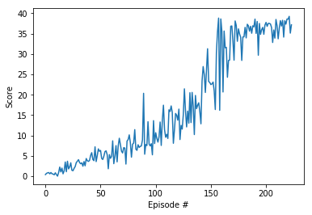

# Continuous-Control Project report


## Introduction

In Reacher environment a reward of +0.1 is provided for each step that the agent's hand is in the goal location. 
Thus, the goal of the agent is to maintain its position at the target location for as many time steps as possible.

The observation space consists of 33 variables corresponding to position, rotation, velocity, and angular velocities 
of the arm. Each action is a vector with four numbers, corresponding to torque applicable to two joints. 
Every entry in the action vector should be a number between -1 and 1.

The project requires that the agent must get an average score of +30 over 100 consecutive episodes. 
To meet the requirement, the Deep Deterministic Policy Gradient algorithm (DDPG) [Continuous control with deep reinforcement learning](https://arxiv.org/abs/1509.02971) is implemented. 
The model successfully solves the environment after 117 episodes.

## The Model

The model is implemented using torch framework and python 3.  The actor of DDPG Q-learning (DQN) consists of an input layer, an output layer and a number 
of hidden layers:

```
        input = nn.Linear(state_size, actor_units[0])
        batch_norm = nn.BatchNorm1d(actor_units[0])
        hidden_layers = nn.ModuleList([nn.Linear(size_in, size_out) for size_in, size_out in zip(actor_units[:-1], actor_units[1:])])
        output = nn.Linear(actor_units[-1], action_size)
```
where state_size = 33 is the dimension of each state, action_size = 4 is the dimension of each action. actor_units is an array of hidden layer units. The batch normalization 
is applied to the first layer.

The architecture of the critic  is similar to the actor, consisting of also an input layer, an output layer and a number 
of hidden layers:

```
        input = nn.Linear(state_size, critic_units[0])
        batch_norm = nn.BatchNorm1d(critic_units[0])
        critic_units[0] += action_size
        hidden_layers = nn.ModuleList([nn.Linear(size_in, size_out) for size_in, size_out in zip(critic_units[:-1], critic_units[1:])])
        output = nn.Linear(units[-1]+action_size, 1)
```
actor_units is an array used to hidden layer units. The batch normalization 
is applied to the first layer. 
As in the standard DDPG, the experience replay uses a replay buffer (ReplayBuffer). ReplayBuffer is implemented using namedtuple and deque of python collections

```
   memory = deque(maxlen=buffer_size) 
   experience = namedtuple("Experience", field_names=["state", "action", "reward", "next_state", "done"])
```
An experience is a named tuple consisting of state, action, reward, next state and done, where done flags if the terminated state is reached. 
In addition, Ornstein-Uhlenbeck process is used as well.

The model can configured differently, for example,  by selecting  different number of hidden layers and choosing different unit sizes for hidden layers. e
After some parameter tuning actor_units=critic_units=[128, 128] is selected in the final run.

## Hyper parameters

Other hyper parameters used in the model are 

* Replay buffer size 100,000 
* batch size = 128
* Discount factor 0.99 (gamma)
* Soft update factor 0.001 (tau)
* Learning rate of the actor 0.0001 
* Learning rate of the critic 0.0001 

## Results
The model runs reasonably fast.  The graph shows the rewards per episode 



The average scores per 100 episodes as shown as follows. The model solve the environment after 117 episodes. The agent receives average score more than 13 over the last 100 episode.  

```
Episode 100	Average Score: 5.17
Episode 200	Average Score: 26.75
Episode 217	Average Score: 30.11
Environment solved in 117 episodes!	Average Score: 30.11
```

## Conclusions

DDPG performs very well to achieve the goal. The model can be easily modify to solve the second version of the environment.
Other actor-critic algorithms can also be used to solve this kind of environment 

* A3C - Asynchronous Advantage Actor-Critic
* A2C - Advantage Actor-Critic
* PPO - Proximal Policy Optimization
* D4PG - Distributed Distributional Deterministic Policy Gradients

It is very interesting to compare them with DDPG. Some of them, for example D4PG,  very likely perform better.


